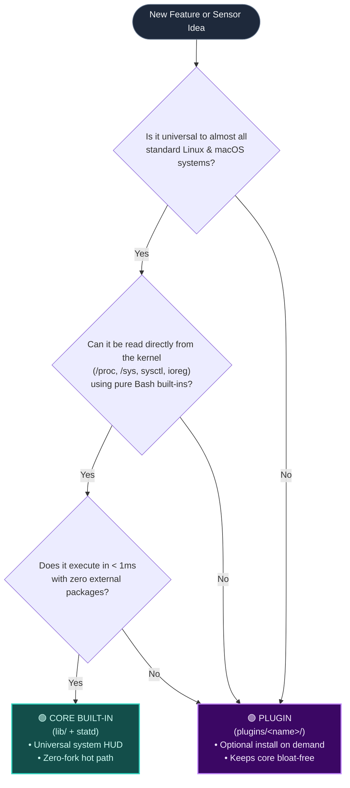

# Contributing to StatD

Thank you for contributing to StatD!

StatD is built to be an ultra-lean, zero-dependency, zero-fork terminal HUD that runs everywhere—from single-board computers and Android/Termux devices to multi-core macOS workstations and enterprise Proxmox VE hypervisors.

To maintain maximum performance and reliability, we follow a set of conventions outlined below.

---

## Quick Checklist Before Submitting a PR

- [ ] Run `make check` — all files must pass bash syntax checks.
- [ ] Run `./bundle.sh` if modifying `statd` or any files in `lib/`.
- [ ] Keep the **hot path fork-free** (the 1-second display loop should never spawn unnecessary subprocesses).
- [ ] Determine whether your change belongs in **Core** or as a **Plugin** (see guide below).
- [ ] Format your commit messages using **Conventional Commits**.
- [ ] Test on your target platform and note the environment in the PR.

---

## Decision Guide: Built-in (Core) vs. Plugin

StatD's guiding principle is to be **bloat-free, sub-millisecond fast, and zero-dependency**.
To keep the core binary ultra-lean, use this guide to decide whether your contribution belongs in **Core** or as an optional **Plugin**:



### 🟢 When it belongs in Core (Built-in)

Add your changes to `lib/` and `statd` if:
1. **Universal Relevance**: It applies to virtually all standard machines (e.g. CPU, RAM, Swap, root filesystem, system load, platform temperature, laptop battery).
2. **Kernel-Native & Zero Overhead**: The data is readable directly from `/proc`, `/sys`, `sysctl`, or `ioreg` with pure Bash built-ins.
3. **Zero External Packages**: It does not depend on external CLI packages (`pvesm`, `zfs`, `docker`, `kubectl`) that are absent on minimal systems.
4. **Sub-Millisecond Execution**: Reading and parsing takes < 1ms on each cycle.

### 🟣 When it belongs as a Plugin (`plugins/<name>`)

Create a new directory in `plugins/<name>/` if:
1. **Specialized Hypervisors & Filesystems**:
   - Proxmox VE storage (`pvesm status`), multi-drive ZFS pool monitors (`zpool list`), Ceph, or Btrfs pool status.
   - Container & VM engines (Docker, Podman, LXC, Kubernetes).
2. **Daemon & Service Monitoring**:
   - Web servers (Nginx/Apache), databases (Postgres, Redis), UPS daemons (`apcupsd`, `nut`), or specific AI endpoints (Ollama, vLLM).
3. **Requires Optional External Binaries**:
   - The feature relies on commands or utilities that the user must explicitly install or configure.
4. **Extended UI / Tooling / Exporting**:
   - Interactive configuration tools (like `statd-theme`) or HTTP/JSON streaming services (like `statd-api`).
5. **Higher Latency Polling**:
   - Commands that take tens or hundreds of milliseconds to query, or perform non-cached disk I/O.

### How Plugins Work

Plugins live in `plugins/<plugin-name>/` and follow a standard structure:
- `plugins/<name>/statd-<name>` — Executable bash script (must define `VERSION="..."` and handle `-v` / `--help`).
- `plugins/<name>/README.md` — Usage guide and installation instructions.
- Users install plugins on demand with `statd install <name>`, and update them with `statd plugin update <name>` or via the one-click menu in `statd about`.

---

## Git Commit Guidelines

We follow the [Conventional Commits](https://www.conventionalcommits.org/) specification so that our project history remains clean, searchable, and automatable.

Format:
```
<type>(<scope>): <short description in present tense>
```

### Commit Types

| Type | Purpose | Example |
|---|---|---|
| `feat` | New feature, sensor, theme, or plugin | `feat(sensors): add pvesm and zpool storage pool detection` |
| `fix` | Bug fix, parser correction, or edge-case handling | `fix(sensors): fix /proc stat field parsing and octal loadavg` |
| `perf` | Performance improvements (e.g. removing forks, subshells) | `perf(render): inline RGB arithmetic to eliminate subshell forks` |
| `docs` | Documentation updates (README, guides, comments) | `docs: add Proxmox storage pool configuration guide` |
| `refactor` | Code restructuring without behavioral changes | `refactor(lib): simplify theme dispatcher functions` |
| `chore` | Maintenance tasks, bundle generation, CI, tests | `chore: update dist/statd bundle via bundle.sh` |

### Recommended Scopes

- `sensors` — `lib/sensors_linux.sh`, `lib/sensors_macos.sh`, `lib/sensors.sh`
- `render` — `lib/render.sh`, gradient calculations, formatting
- `theme` — `plugins/theme/`, palette definitions, picker UI
- `api` — `plugins/api/`, streaming JSON interface
- `core` — `statd` main script, flags, keyboard loops
- `install` — `install.sh`, `bundle.sh`, `Makefile`

---

## Architecture & Coding Standards

### 1. Zero-Fork Hot Path
The core HUD loop executes every second (`INTERVAL=1`). Avoid spawning external binaries (`grep`, `awk`, `cut`, `sed`, `bc`) inside this loop whenever possible:
- **Bash Built-ins**: Use parameter expansions (`${val%%/*}`, `${val//./}`) and `read` instead of `cut` or `awk`.
- **Direct `/proc` Reads**: Use `{ read -r a b c < /proc/...; } 2>/dev/null` instead of `cat /proc/... | grep`.
- **Integer Arithmetic**: Use `$(( ... ))` directly. Avoid wrapping arithmetic inside function subshells `$(func "$val")` inside loops.

### 2. Defensive Parsing
- **Explicit Base-10 Arithmetic**: When processing numbers that could have a leading zero (e.g. load average `0.28` stripped of dot becomes `028`), always force base-10 using:
  ```bash
  L100=$(( 10#${L1/./} ))
  ```
  Otherwise, bash interprets numbers with leading zeros as octal, causing crashes on digits `8` and `9`.
- **Catch-All Trailing Variables**: Always append a discard variable (e.g. `_junk`) when reading multi-column data (`/proc/[pid]/stat`, `/proc/stat`) to prevent bash from assigning all remaining columns into the final variable:
  ```bash
  read -r _ _ _ _ _ _ _ _ _ _ _ L_UT L_ST _ _ _ _ _ _ _ _ L_RSS _junk <<< "$rest"
  ```
- **Regex Validation**: Always validate numeric strings before arithmetic:
  ```bash
  [[ "$val" =~ ^[0-9]+$ ]] || val=0
  ```

### 3. Locale and Encoding Safety
- Avoid byte-slicing strings (`${str:0:$n}`) on multibyte UTF-8 characters (like block elements `█` or shaded blocks `░`), because in `C` / non-UTF-8 locales bash slices raw bytes.
- Use pre-indexed arrays (`_STATD_EMPTY_CACHE[$n]`) for character retrieval.
- Use ANSI-C quoting (`$'\xc2\xb7'`) or literal UTF-8 characters (`·`, `●`, `└`) rather than `\x` inside double quotes `""`.

### 4. Cross-Platform Parity
- When introducing a Linux-specific feature or sensor, ensure the dispatcher in `lib/sensors.sh` gracefully handles macOS and other platforms with a clean fallback.

---

## Repository Structure

```
statd                   Main executable entry point & UI loop
bundle.sh               Bundles statd and lib/*.sh into dist/statd
dist/statd              Self-contained single-file standalone build
install.sh              One-line installer script
Makefile                make check, make install, make uninstall
lib/
  ├── colors.sh         Terminal color constants and ANSI palette
  ├── llm.sh            llama.cpp metrics & process discovery
  ├── render.sh         Gradient bars, cell formatting, human units
  ├── sensors.sh        Dispatcher layer & OS routing
  ├── sensors_linux.sh  Linux / Android / Proxmox sensors (/proc, /sys)
  └── sensors_macos.sh  macOS sensors (sysctl, ioreg, vm_stat)
plugins/
  ├── api/              High-performance JSON streaming API plugin
  └── theme/            Theme manager & 24 curated color palettes
```

---

## Submitting a Pull Request

1. **Fork the Repository**:
   Fork [Jaseunda/statd](https://github.com/Jaseunda/statd) to your GitHub account.

2. **Create a Feature Branch**:
   ```bash
   git checkout -b feat/proxmox-storage-pools
   ```

3. **Make Your Changes**:
   - Keep code modular and clean.
   - If you modified `statd` or any file in `lib/`, run:
     ```bash
     ./bundle.sh
     ```

4. **Verify Syntax**:
   ```bash
   make check
   ```

5. **Commit with Conventional Commits**:
   ```bash
   git commit -m "feat(sensors): add pvesm and zpool storage pool detection"
   ```

6. **Push and Open PR**:
   ```bash
   git push origin feat/proxmox-storage-pools
   ```
   Open a Pull Request against `main`. Fill out the PR template with details of your testing environment (e.g., Proxmox VE version, ZFS pool structure).

---

## License

By contributing to StatD, you agree that your contributions will be licensed under the project's [MIT License](LICENSE).
