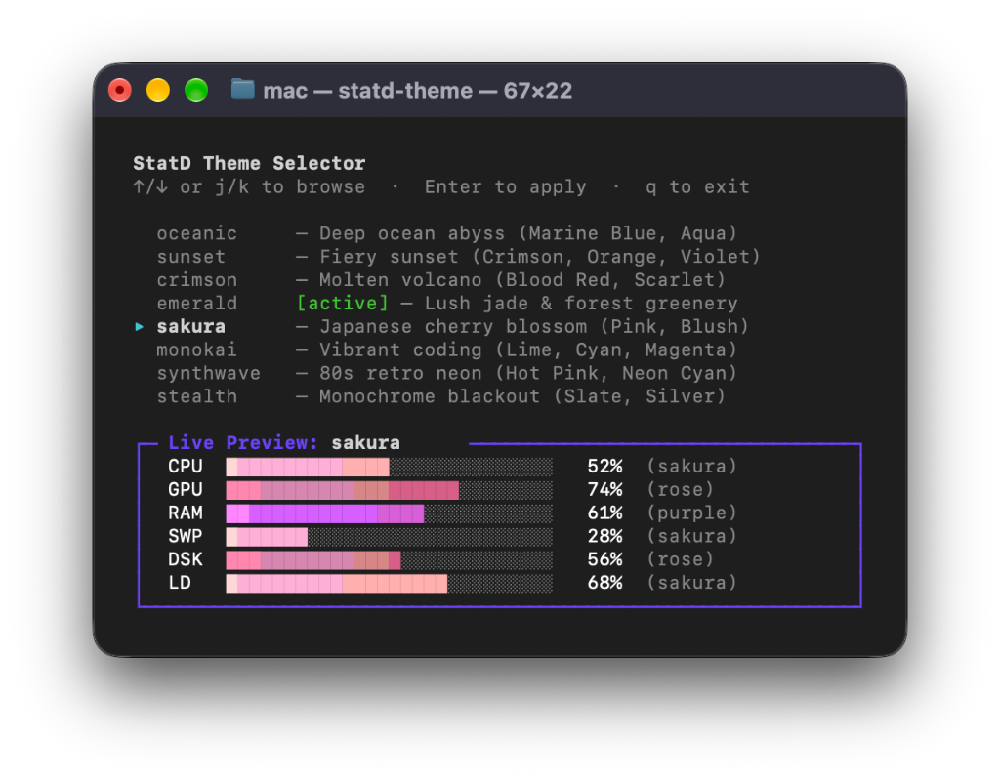

# statd

A minimal, flicker-free system stats HUD for your terminal.

No heavy frameworks. No compiling. Just launch and go.

<p align="center">
  <picture>
    <source media="(prefers-color-scheme: dark)" srcset="assets/statd-dark.png">
    <source media="(prefers-color-scheme: light)" srcset="assets/statd-light.png">
    
  </picture>
</p>

## Install

```sh
curl -fsSL https://raw.githubusercontent.com/Jaseunda/statd/main/install.sh | bash
```

Or from source:

```sh
git clone https://github.com/Jaseunda/statd.git
cd statd
make install PREFIX=~/.local
```

> **macOS Note:** Requires modern Bash (`brew install bash`). The installer will guide you through this automatically.

## Run

```sh
statd
```

### Keyboard Shortcuts

While running, you can press any of these keys anytime:

| Key | Action |
|-----|--------|
| `f` / `w` | Toggle full-width stretch (edge-to-edge) |
| `c` | Toggle per-core CPU panel |
| `g` | Toggle GPU (`GPU`) |
| `l` | Toggle Load average (`LD`) |
| `b` | Toggle Battery (`BAT`) |
| `s` | Toggle Swap (`SWP`) |
| `d` | Toggle Disk (`DSK`) |
| `q` | Quit |

## Customizing Views

Turn off views you don't need with the `config` command:

```sh
# Turn off load average (LD) or GPU
statd config disable ld
statd config disable gpu

# Turn off battery (BAT)
statd config disable bat

# Turn any view back on
statd config enable ld
statd config enable gpu
statd config enable bat

# See your current settings
statd config
```

You can also hide views on the fly with command-line flags:

```sh
statd --no-gpu          # Run without GPU row
statd --no-ld           # Run without load average
statd --no-bat          # Run without battery
statd --no-ld --no-bat  # Run without load average or battery
```

## Plugins (Optional Features)

StatD keeps the terminal HUD minimal and bloat-free, but allows adding extra features via on-demand plugins:

```sh
# List plugins
statd plugins

# Install the streaming API plugin
statd install api
```

### Streaming API Plugin (`statd api`)

Expose real-time metrics over an ultra-low CPU HTTP server with JSON and Server-Sent Events (SSE):

```sh
# Start API server on http://localhost:8080
statd api

# Run as background daemon
statd api --daemon --port 8080
statd api status
statd api stop

# Query snapshot via curl or script
curl http://localhost:8080/stats
```

Connect web dashboards and custom interfaces in real-time with zero polling:

```javascript
const sse = new EventSource("http://localhost:8080/stream");
sse.onmessage = (e) => {
  const stats = JSON.parse(e.data);
  console.log(`CPU: ${stats.cpu.percent}% | RAM: ${stats.memory.percent}%`);
};
```

### Theme & Palette Plugin (`statd theme`)

Customize bar colors or switch between premade color palettes with live visual previews:

<p align="center">
  <picture>
    <source media="(prefers-color-scheme: dark)" srcset="assets/statd-theme-dark.png">
    <source media="(prefers-color-scheme: light)" srcset="assets/statd-theme-light.png">
    
  </picture>
</p>

```sh
# Install the theme plugin
statd install theme

# Launch interactive theme picker
statd theme

# List available themes with live previews
statd theme list

# Switch to a premade theme
statd theme set cyberpunk
statd theme set nord
statd theme set dracula
statd theme set matrix
statd theme set sunset

# Customize an individual metric color or custom RGB gradient
statd theme set-color gpu amber
statd theme set-color gpu 0,255,200:0,100,255
```

### AI Model Context Protocol Plugin (`statd mcp`)

Expose real-time hardware telemetry and local LLM performance (`llama.cpp` / Ollama) directly to AI coding assistants (**Claude Desktop**, **Cursor**, **Antigravity**, **Windsurf**, **Zed**) over standard JSON-RPC `stdio`:

```sh
# Install the MCP plugin
statd install mcp

# Test tool execution locally
statd mcp --test
```

Configure in Claude Desktop (`claude_desktop_config.json`) or Cursor / Antigravity (`mcp_config.json`):

```json
{
  "mcpServers": {
    "statd": {
      "command": "statd",
      "args": ["mcp"]
    }
  }
}
```

AI assistants can then automatically query:
- `statd_get_metrics`: CPU, per-core load, RAM, swap, disk, temperature, and battery.
- `statd_get_llm_metrics`: Local LLM inference speed (tokens/sec), KV cache ratio, process PID.
- `statd_get_system_info`: Hardware specs, OS, kernel, cores, architecture, uptime.
- `statd_diagnose_bottlenecks`: Automated analysis of thermal throttling, memory pressure, or swap thrashing.


## About & System Info (`statd about`)

Check your StatD core version, installed plugin versions, system environment, and perform one-click updates directly from an interactive TUI card:

```sh
# View interactive system info and one-click updater
statd about

# Non-interactive JSON output for scripts
statd about --json
```

While in `statd about`, you can update StatD or plugins with a single keypress:
- `[u]` — Update All (StatD Core + all installed plugins)
- `[s]` — Update StatD Core only
- `[p]` — Update all installed plugins
- `[1]` / `[2]` — Update specific plugin directly
- `[q]` — Exit

## Updates & Plugin Maintenance

Keep StatD core and your plugins up to date with a single command:

```sh
# Update StatD core
statd --update
# or: statd update

# Update all installed plugins
statd update plugins
# or: statd plugins update

# Update a specific plugin
statd update theme
statd update api
# or: statd theme update, statd api update

# Update StatD core AND all installed plugins in one go
statd update all

# Check for updates without installing
statd --check-update
```

## Zero-Install (Light Setups)

For temporary containers (Docker, LXC) or servers where you don't want to install anything, run the standalone single-file bundle directly:

```sh
curl -fsSL https://raw.githubusercontent.com/Jaseunda/statd/main/dist/statd | bash
```

## Options

| Command / Flag | Description |
|----------------|-------------|
| `about`, `-a` | System specs, plugin versions & interactive one-click updater |
| `update [all\|plugins\|name]` | Update StatD core and/or plugins |
| `install <name>` | Install a plugin (e.g. `statd install api`) |
| `plugins` | List available and installed plugins |
| `plugins update [name]` | Update installed plugin or all plugins |
| `api [options]` | Start the streaming API server (after `install api`) |
| `theme [options]` | Manage themes and colors (after `install theme`) |
| `-f, --full` | Stretch to fill terminal width (auto on mini displays) |
| `-u, --update` | Update statd to latest version |
| `--check-update` | Check for updates |
| `--config [cmd]` | Manage view toggles (`statd config`) |
| `--no-cpu` | Hide CPU row |
| `--no-gpu` | Hide GPU row |
| `--no-ram` | Hide RAM row |
| `--no-ld` | Hide load average row |
| `--no-bat` | Hide battery row |
| `--no-swp` | Hide swap row |
| `--no-dsk` | Hide disk row |
| `-c, --cores` | Start with per-core CPU panel shown |
| `-i, --interval <sec>` | Refresh speed in seconds (default: 1) |
| `-v, --version` | Show version |
| `-h, --help` | Show all options |

## License

MIT. See [LICENSE](LICENSE).
