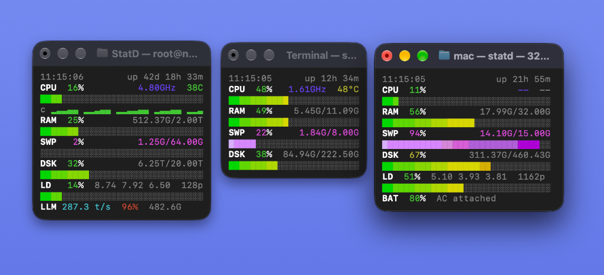

# statd

A minimal, flicker-free system stats HUD for your terminal.

No heavy frameworks. No compiling. Just launch and go.

<p align="center">
  <picture>
    <source media="(prefers-color-scheme: dark)" srcset="assets/statd-dark.png">
    <source media="(prefers-color-scheme: light)" srcset="assets/statd-light.png">
    
  </picture>
</p>

## Install

```sh
curl -fsSL https://raw.githubusercontent.com/Jaseunda/statd/main/install.sh | bash
```

Or from source:

```sh
git clone https://github.com/Jaseunda/statd.git
cd statd
make install PREFIX=~/.local
```

> **macOS Note:** Requires modern Bash (`brew install bash`). The installer will guide you through this automatically.

## Run

```sh
statd
```

### Keyboard Shortcuts

While running, you can press any of these keys anytime:

| Key | Action |
|-----|--------|
| `f` / `w` | Toggle full-width stretch (edge-to-edge) |
| `c` | Toggle per-core CPU panel |
| `g` | Toggle GPU (`GPU`) |
| `l` | Toggle Load average (`LD`) |
| `b` | Toggle Battery (`BAT`) |
| `s` | Toggle Swap (`SWP`) |
| `d` | Toggle Disk (`DSK`) |
| `q` | Quit |

## Customizing Views

Turn off views you don't need with the `config` command:

```sh
# Turn off load average (LD) or GPU
statd config disable ld
statd config disable gpu

# Turn off battery (BAT)
statd config disable bat

# Turn any view back on
statd config enable ld
statd config enable gpu
statd config enable bat

# See your current settings
statd config
```

You can also hide views on the fly with command-line flags:

```sh
statd --no-gpu          # Run without GPU row
statd --no-ld           # Run without load average
statd --no-bat          # Run without battery
statd --no-ld --no-bat  # Run without load average or battery
```

## Plugins (Optional Features)

StatD keeps the terminal HUD minimal, lightweight, and bloat-free, while providing optional capabilities through standalone official plugins:

| Plugin | Command | Description | Documentation |
|--------|---------|-------------|---------------|
| **Theme** | `statd theme` | 32 curated color palettes (light & dark mode ready), live interactive picker, custom RGB | [Theme Plugin Guide](plugins/theme/README.md) |
| **API** | `statd api` | Ultra-low CPU HTTP server with JSON snapshots & Server-Sent Events (SSE) streaming | [API Plugin Guide](plugins/api/README.md) |
| **MCP** | `statd mcp` | Model Context Protocol server for AI coding assistants (Claude, Cursor, Antigravity) | [MCP Plugin Guide](plugins/mcp/README.md) |

### Plugin Management

```sh
# List available and installed plugins
statd plugins

# Install an official plugin
statd install theme
statd install api
statd install mcp

# Update plugins
statd update plugins         # update all installed plugins
statd update theme           # update a specific plugin

# Remove a plugin
statd remove <plugin>
```


## About & System Info (`statd about`)

Check your StatD core version, installed plugin versions, system environment, and perform one-click updates directly from an interactive TUI card:

```sh
# View interactive system info and one-click updater
statd about

# Non-interactive JSON output for scripts
statd about --json
```

While in `statd about`, you can update StatD or plugins with a single keypress:
- `[u]` — Update All (StatD Core + all installed plugins)
- `[s]` — Update StatD Core only
- `[p]` — Update all installed plugins
- `[1]` / `[2]` — Update specific plugin directly
- `[q]` — Exit

## Updates & Plugin Maintenance

Keep StatD core and your plugins up to date with a single command:

```sh
# Update StatD core
statd --update
# or: statd update

# Update all installed plugins
statd update plugins
# or: statd plugins update

# Update a specific plugin
statd update theme
statd update api
# or: statd theme update, statd api update

# Update StatD core AND all installed plugins in one go
statd update all

# Check for updates without installing
statd --check-update
```

## Zero-Install (Light Setups)

For temporary containers (Docker, LXC) or servers where you don't want to install anything, run the standalone single-file bundle directly:

```sh
curl -fsSL https://raw.githubusercontent.com/Jaseunda/statd/main/dist/statd | bash
```

## Options

| Command / Flag | Description |
|----------------|-------------|
| `about`, `-a` | System specs, plugin versions & interactive one-click updater |
| `update [all\|plugins\|name]` | Update StatD core and/or plugins |
| `install <name>` | Install a plugin (e.g. `statd install api`) |
| `plugins` | List available and installed plugins |
| `plugins update [name]` | Update installed plugin or all plugins |
| `api [options]` | Start the streaming API server (after `install api`) |
| `theme [options]` | Manage themes and colors (after `install theme`) |
| `mcp [options]` | Model Context Protocol server for AI coding assistants |
| `-f, --full` | Stretch to fill terminal width (auto on mini displays) |
| `-u, --update` | Update statd to latest version |
| `--check-update` | Check for updates |
| `--config [cmd]` | Manage view toggles (`statd config`) |
| `--no-cpu` | Hide CPU row |
| `--no-gpu` | Hide GPU row |
| `--no-ram` | Hide RAM row |
| `--no-ld` | Hide load average row |
| `--no-bat` | Hide battery row |
| `--no-swp` | Hide swap row |
| `--no-dsk` | Hide disk row |
| `-c, --cores` | Start with per-core CPU panel shown |
| `-i, --interval <sec>` | Refresh speed in seconds (default: 1) |
| `-v, --version` | Show version |
| `-h, --help` | Show all options |

## License

MIT. See [LICENSE](LICENSE).
